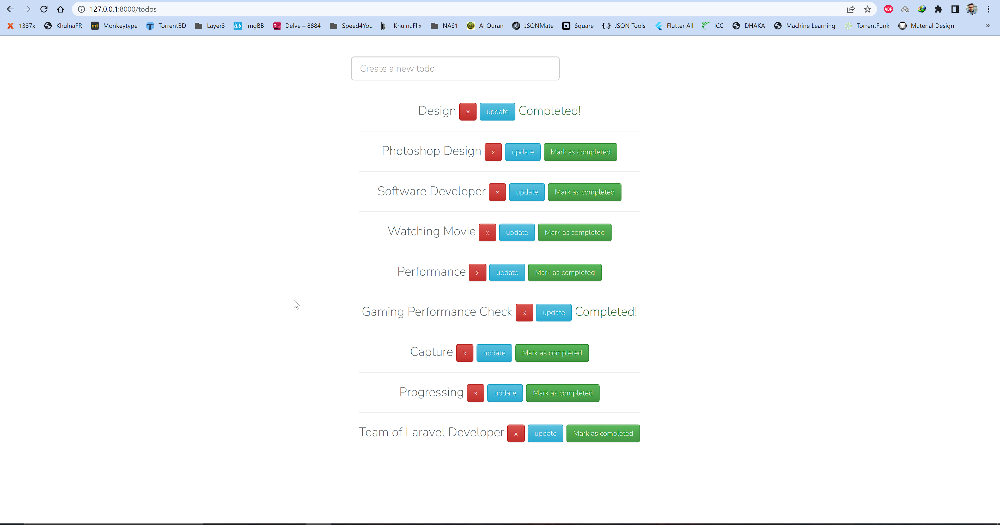

# Todos

* Make connection with MySQL database
* Insert Dummy data from [Fill DB](http://filldb.info/dummy/step1)
* Understanding blade in [Laravel](https://laravel.com/) 
* Understanding Model in [Laravel](https://laravel.com/) 
* Understanding Route in [Laravel](https://laravel.com/)
* Understanding Controller in [Laravel](https://laravel.com/)
* Understanding Layout Export and Cleaning the blade in [Laravel](https://laravel.com/)
* Understanding Phs artisan Command in [Laravel](https://laravel.com/)
* Understanding Bootstrap in [Laravel](https://laravel.com/)
* Understanding Foreach and if-else in [Laravel](https://laravel.com/)
* Insert Data in DB
* Update Data in DB
* Delete Data in DB
* Complete Project View
    - 